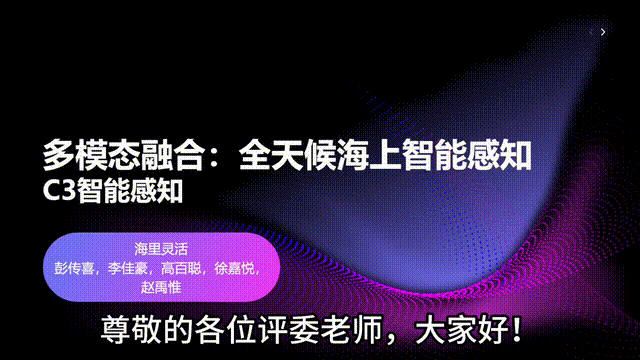
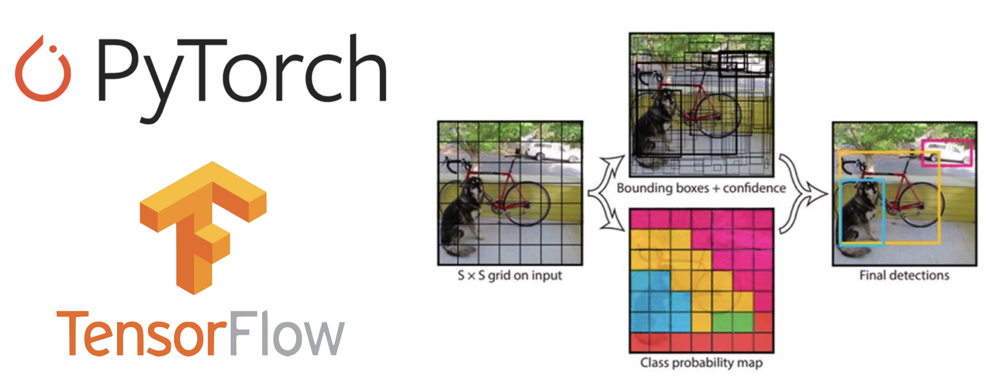
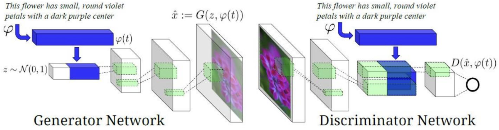

  <h1>第十四届全国海洋航行器设计与制作大赛
  <h2>C3智能感知代码平台

  <h3> 团队名：海里灵活
  <h3> 队长：彭传喜 &nbsp;&nbsp; 队员：李佳豪、赵禹惟、高百聪、徐嘉悦
  <h3> 指导老师：闫劢

---

  <h3>🎉🎉🎉 恭喜 “海里灵活” 团队成功拿下全国二等奖!!! 
  🎉🎉🎉

> 注：详见 [**获奖名单**](./获奖名单.pdf)

---

## 一、 项目简介
本项目面向琼州海峡等复杂海况海域的低能见度航行挑战，提出一套融合毫米波雷达点云与可见光图像的多模态感知算法系统。通过 YOLOv8 深度学习模型与早期数据融合策略，提升海上小目标（如浮标、渔船）在恶劣天气下的精准检测与动态跟踪能力。

---

## 二、成果展示

  

> 注：原视频见 [**演示视频**](./doc/国赛上交材料/Vlog/海里灵活-vlog.mov)

## 三、项目主体结构
<pre><code>
src/
├── data/                             # 数据处理相关脚本
│   ├── convert_voc_to_yolo.py        # 将VOC XML转换为YOLO TXT
│   ├── split_dataset.py              # 划分数据集
│   ├── analyze_classes.py            # 分析原始数据，生成类别列表
│   └── visualize_data.py             # 可视化标注数据，用于数据质检
│
├── models/                           # 模型相关脚本
│   ├── train.py                      # 使用YOLOv8训练目标检测模型
│   └── evaluate.py                   # 在测试集上评估模型性能
│
├── utils/                            # 工具函数
│   └── quantization.py               # 模型量化脚本
└── classes.txt                       # 分类结果
</code></pre>

---

## 四、具体说明
### 1. 功能概述
| 模块     | 功能描述 |
|----------|----------|
| `data/` | 存放原始、处理中和最终的数据集，实现数据流的清晰管理 |
| `src/data/` | 提供数据预处理工具，包括格式转换、数据集划分、类别分析和数据可视化 |
| `src/models/` | 核心模型训练与评估脚本，实现模型的全生命周期管理 |
| `src/utils/` | 提供模型优化工具，如量化，以减小模型体积，便于部署 |

### 2.核心创新
-  深度融合架构：采用自定义网络结构，将毫米波雷达与RGB图像在数据层面进行早期融合。
- 鲁棒目标检测：结合YOLOv8检测器，有效抑制海浪背景干扰，提高在大雾、雨天等恶劣条件下的小目标检测精度。
- 轻量化部署：支持模型 INT8 量化，便于在边缘设备上实时部署。
- 完整工具链支持：从 VOC → YOLO 格式转换、数据可视化、类别统计，到训练、评估与量化压缩，提供端到端开发支持。

### 3. 相关配置说明
| 内容 | 说明 |
|-------------|-----------|
| 数据集 | 基于 **SeaShips** 数据集，并融合了毫米波雷达模拟数据 |
| 模型 | **YOLOv8s** (轻量级，适用于边缘计算) |
| 输入尺寸 | **640x640** 像素 |
| 训练轮次 (Epochs) | **150** |
| 批处理大小 (Batch Size) | **16** (GPU) / **8** (CPU) |
| 评估指标 | **mAP@0.5**, **mAP@0.5:0.95**, Precision, Recall |

### 4. 支撑作品的现有理论与技术

    

本作品主要基于 **PyTorch / TensorFlow** 深度学习框架进行开发，环境依赖于 **Python 3.8+、CUDA**（GPU 加速）以及 **requirements.txt** 中列出的所有包，如 numpy, pandas, matplotlib, opencv - python, torch / tensorflow, torchvision / tensorflow-addons 等。基础检测算法基于 **YOLOv5 / YOLOv8**（作为高效检测基线）、**CenterNet**（无锚框，适合密集目标）、或 **Transformer - based** 检测器（如DETR 系列）。我们使用在 **COCO** 或 **ImageNet** 等大规模数据集上预训练的骨干网络权重，以加速模型收敛并提升特征提取能力。在建模算力与环境方面，我们通常使用 NVIDIA GeForce RTX 3090 / 4090 和 A100 GPU，配合 16GB+ RAM，并在 **Ubuntu 20.04 LTS 或 Windows 10/11** 系统下进行。

### 5. 国内外水平对比
目前国内外针对海上目标感知多以光学传感器为主，在复杂天气下性能受限。部分研究探索多模态融合， 但多集中于自动驾驶领域，海上专用融合方案相对较少， 且多为传统数据级或决策级融合， 未能充分挖掘多模态传感器间的深层互补信息。本方案聚焦恶劣天气下海上场景的雷达-图像深度融合，通过定制化的网络结构和抗干扰策略，有望在检测精度、误检/漏检率及实时性方面超越现有单一模态或浅层融合方法，达到更优的综合性能。

### 6. 不足及展望

    

目前，本作品主要依赖仿真数据集（**WaterScenes**）进行开发和验证，未来可能需要少量真实场景数据进行微调与验证，以应对仿真与实际环境可能存在的差异。此外，对复杂海上环境中的极端干扰（如强降雨、海燕群等）的鲁棒性可能仍有提升空间。对于目标运动状态（如小型渔船的快速变向）的精确跟踪，未来可能需要引入更复杂的**卡尔曼滤波**或**扩展卡尔曼滤波与目标关联**算法。展望未来，我们将尝试引入时序信息，结合视频和雷达序列数据，利用时序网络（如 **RNN, Transformer**）来提升目标跟踪的稳定性，并预测目标未来运动轨迹。我们还将探索多传感器异构融合，考虑加入**声呐**、**AIS** 等更多传感器数据，以构建更全面、更鲁棒的感知系统。同时，可以尝试利用强化学习，让模型在不同天气和海况下自适应调整感知策略。最后，我们将继续致力于边缘计算优化，进一步优化模型，实现更低功耗、更高效率的嵌入式部署，以支持船载边缘设备的实时感知需求。

#### ⚠️ License: 该项目非开源. 详见 [LICENSE](./LICENSE).

---

